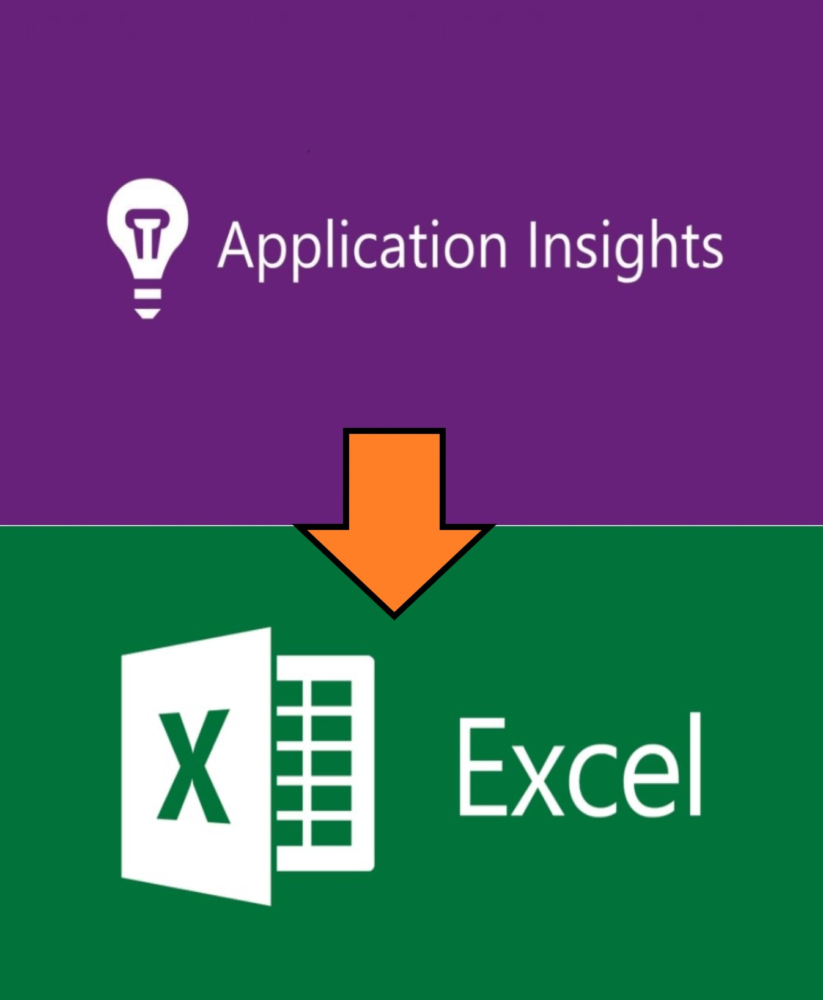

# How to get Azure Application Insights metrics to Excel

This is example how to explore your metrics in Excel. 
1. Download https://github.com/VirtoCommerce/vc-hosting/tree/master/tools/AppInsights-Template.xlsx 
2. Enable content and authorize as anonymous in first time.
3. Change API keys to yours.
4. Update Data.

More instructions you can find https://github.com/VirtoCommerce/vc-hosting/blob/master/docs/AppInsights-Template.md

The benefits of this solution.
1. There is no need to access the Azure portal, you only need an API key.
2. All necessary and important metrics are collected in one place.
3. It is easy to observe correlations between metrics and instances.
4. There is no need to configure the portal.
This solution allows me to save time and quickly diagnose the problem.