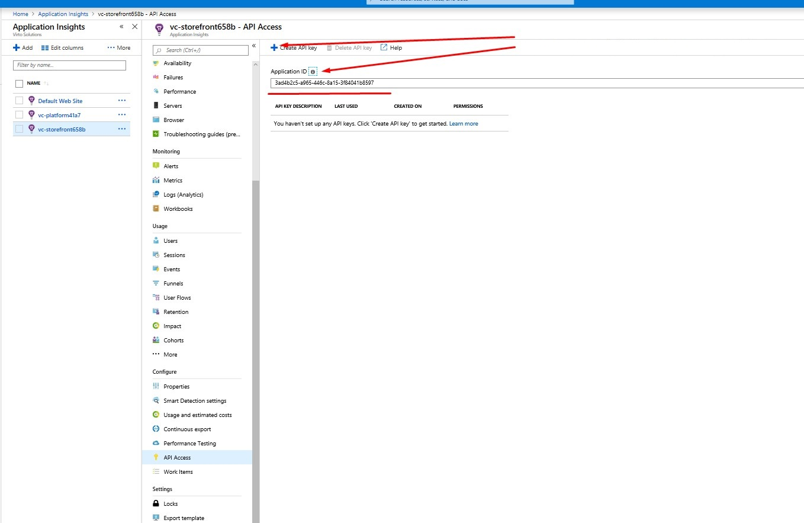
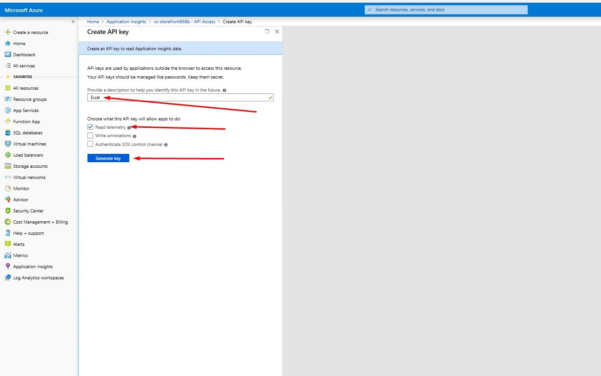
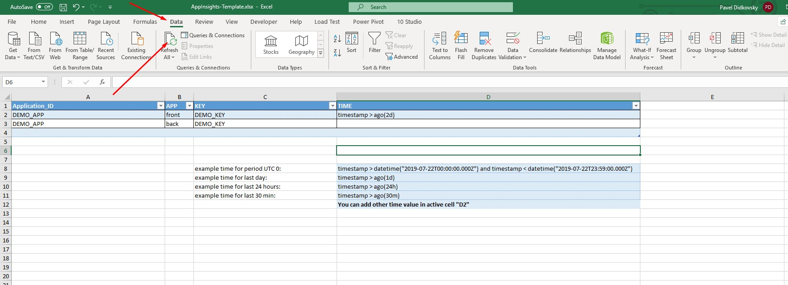

# How to use AppInsights-Template.xlsx 

1. Open vc-hosting\tools\AppInsights-Template.xlsx and enable active content in file. It is automatically update information and metrics.
2. The first sheet named CONFIG there are you can change Application ID, KEY and TIME to yours values. You should get ID and key from Application Insights on Azure Portal. How to get key and Application ID you can see **here**  and **here** 
3. If you want to change TIME period you can use samples in sheet. That time will be applied to all queries in spreadsheet.
4. If you maked changes in file then don't forget to Refresh All Data in your file.
5. The next sheets for **frontend**:
-ServerReqSumFront
-FailureRequestGraph
-FailureRequestsFront
-FailureDependByOper
-FailureDependByType
-FailureDependByTarget
-SyntheticTrafficFront
-Exceptions
-BLOBFront
-ProcessorTime%Front
-minAvailableMemoryFront
-ServRespTimeFront
-BrowserDuration
-uniqUsers
-TracesFront

for **backend**:
-ServerReqSumBack
-FailureRequestsBack
-FailureDependByOperBack
-FailureDependByTypeBack
-FailureDependByTargetBack
-SyntheticTrafficBack
-ExceptionsBack
-SQL
-Search
-BLOBback
-ProcessorTime%Back
-Mem+Proc+req
-minAvailableMemoryBack
-ServRespTimeBack
-TracesBack

